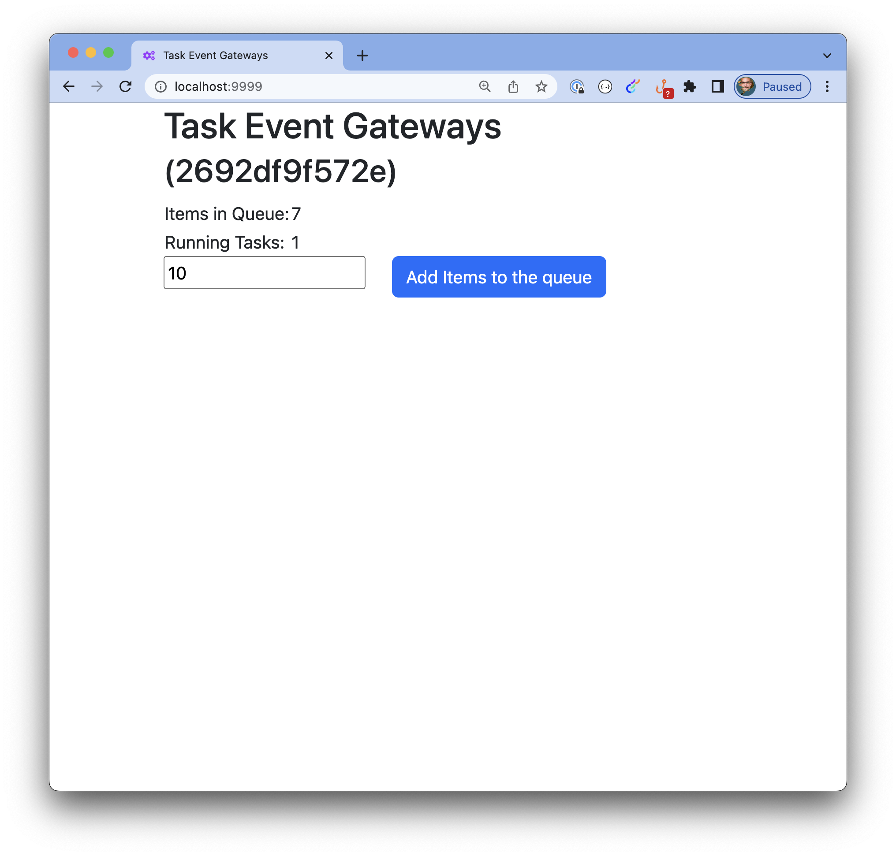
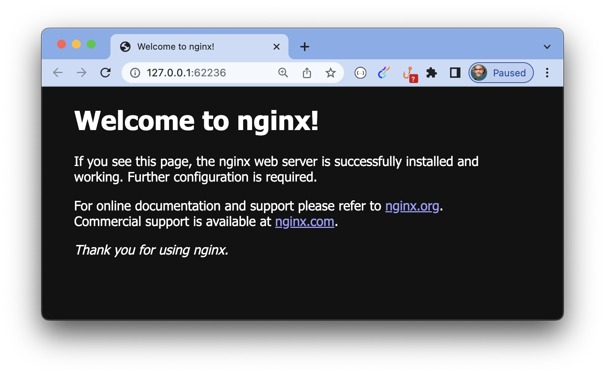
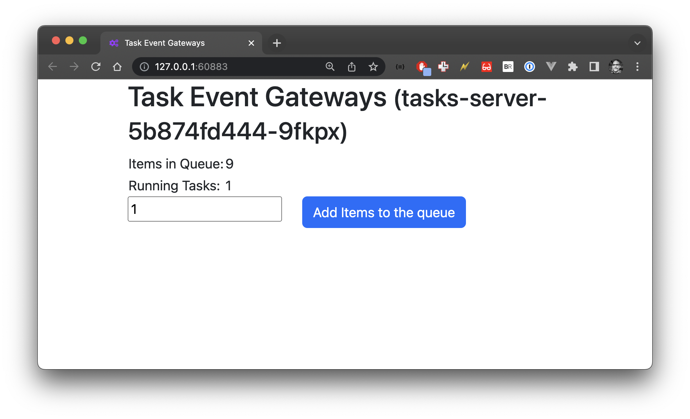
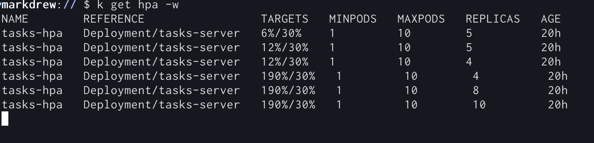

# Lucee Task Event Gateways and Kubernetes 

This repository has a demo of using [Lucee's Task Event Gateways (TEG)](https://github.com/lucee/task-event-gateway) in Kubernetes. 

It shows how you can run the following:
 - Task Event Gateway Demo in Docker Compose
 - How to start and Minikube for scaling
 - How to deploy an example Nginx service in Kubernetes
 - How to deploy the Task Event Gateway Demo in Kubernetes

## Running the Task Event Gateway Demo in Docker Compose
```
docker compose up --build --detach
```
This builds the lucee docker image and copies the config in from `config/lucee-web.xml.cfm`
You can access the demo at http://localhost:9999



To see the command line output fom the task serve you can run the following:
```
docker logs -f app
```

## Running Minikube 
You can start and configure minikube by running the following:
```k8s/minikube_start```
This will run the following:
```
minikube start
minikube addons enable metrics-server
kubectl config use-context minikube
minikube dashboard &
```
The last command will open the dashboard in your browser and you can see the status of your cluster. 

## Running the Nginx Service Demo in Kubernetes
Now we have minikube running we can deploy the nginx service demo. 
```
k8s/nginx/deploy.sh
```
This will run the following commands:
```
kubectl apply -f k8s/nginx/deployment.yaml
kubectl apply -f k8s/nginx/service.yaml
kubectl rollout status deployment -w 
minikube service nginx-service
```
This will open the nginx service in your browser.




## Running the Task Event Gateway Demo in Kubernetes

Finally, we can run our task event gateway in K8s. To do this I have put all the steps in `deploy.sh` so to run:
```
./deploy.sh
```

This runs the following commands:

```

tag=$(date +%s%N | sha256sum | head -c 8)
label="distrokid/teg-demo:${tag}"
echo "Building ${label}"
docker build -t ${label} .
docker tag ${label} distrokid/teg-demo:latest

echo "Starting to load ${label} into minikube"
minikube image load ${label}

echo "Starting to load distrokid/teg-demo:latest into minikube"
minikube image load distrokid/teg-demo:latest

echo "Making sure we have the metrics-server addon enabled"
# Enable metrics server for scaling
minikube addons enable metrics-server
# Make sure we are using the right minkube context
kubectl config use-context minikube
echo "Deploy redis to our minikube cluster"
# Redis stuff
kubectl apply -f k8s/redis/deployment.yaml
kubectl apply -f k8s/redis_ui/deployment.yaml

echo "Deploying the tasks app to our minikube cluster"
# deploy the deployment of the app
kubectl apply -f k8s/tasks/deployment.yaml
kubectl apply -f k8s/tasks/hpa.yaml

echo "Set the image manually so that we can see the rollout status"
# Set the image
kubectl set image deployment/tasks-server tasks-server=${label}
# Check the status
kubectl rollout status deployment/tasks-server
# Check the status of HPA
kubectl get hpa

# open the page to our app
minikube service tasks-server
```
The last command (`minikube service tasks-server`) will open the app in your browser.



You can add a large number of tasks and see the HPA scale up the number of pods.
To view this you can watch the horizontal pod autoscaler (hpa) with the following command:
```
kubectl get hpa -w
```


If you have any questions or comments, you can contact me on twitter [@markdrew](https://twitter.com/markdrew). 

If you find any issues, please open a ticket here. 


